# <a name="tutorial-developing-a-power-bi-visual"></a><span data-ttu-id="ed05c-103">チュートリアル:Power BI のビジュアルを開発する</span><span class="sxs-lookup"><span data-stu-id="ed05c-103">Tutorial: Developing a Power BI visual</span></span>

<span data-ttu-id="ed05c-104">開発者が Power BI に Power BI ビジュアルを簡単に追加して、ダッシュボードとレポートで使用できるようにします。</span><span class="sxs-lookup"><span data-stu-id="ed05c-104">We’re enabling developers to easily add Power BI visuals into Power BI for use in dashboard and reports.</span></span> <span data-ttu-id="ed05c-105">すぐに始められるように、すべての視覚化のコードが GitHub で公開されています。</span><span class="sxs-lookup"><span data-stu-id="ed05c-105">To help you get started, we’ve published the code for all of our visualizations to GitHub.</span></span>

<span data-ttu-id="ed05c-106">視覚化のフレームワークのほか、コミュニティの皆様が Power BI 用に質の高い Power BI ビジュアルをビルドするのに役立つ、テスト スイートとツールが用意されています。</span><span class="sxs-lookup"><span data-stu-id="ed05c-106">Along with the visualization framework, we’ve provided our test suite and tools to help the community build high-quality Power BI visuals for Power BI.</span></span>

<span data-ttu-id="ed05c-107">このチュートリアルでは、Circle Card という名前の Power BI カスタム ビジュアルを開発して、円の中に書式設定されたメジャー値を表示する方法を示します。</span><span class="sxs-lookup"><span data-stu-id="ed05c-107">This tutorial shows you how to develop a Power BI custom visual named Circle Card to display a formatted measure value inside a circle.</span></span> <span data-ttu-id="ed05c-108">Circle Card ビジュアルでは、色の塗りつぶしと枠線の太さのカスタマイズをサポートします。</span><span class="sxs-lookup"><span data-stu-id="ed05c-108">The Circle Card visual supports customization of fill color and thickness of its outline.</span></span>

<span data-ttu-id="ed05c-109">Power BI Desktop レポートでは、Circle Card になるようにカードが修正されます。</span><span class="sxs-lookup"><span data-stu-id="ed05c-109">In the Power BI Desktop report, the cards are modified to become Circle Cards.</span></span>

  

<span data-ttu-id="ed05c-111">このチュートリアルで学習する内容は次のとおりです。</span><span class="sxs-lookup"><span data-stu-id="ed05c-111">In this tutorial, you learn how to:</span></span>
> [!div class="checklist"]
> * <span data-ttu-id="ed05c-112">Power BI カスタム ビジュアルを作成する。</span><span class="sxs-lookup"><span data-stu-id="ed05c-112">Create a Power BI custom visual.</span></span>
> * <span data-ttu-id="ed05c-113">D3 ビジュアル要素を使ってカスタム ビジュアルを開発する。</span><span class="sxs-lookup"><span data-stu-id="ed05c-113">Develop the custom visual with D3 visual elements.</span></span>
> * <span data-ttu-id="ed05c-114">ビジュアル要素を使ってデータ バインドを構成する。</span><span class="sxs-lookup"><span data-stu-id="ed05c-114">Configure data binding with the visual elements.</span></span>
> * <span data-ttu-id="ed05c-115">データ値を書式設定する。</span><span class="sxs-lookup"><span data-stu-id="ed05c-115">Format data values.</span></span>

## <a name="prerequisites"></a><span data-ttu-id="ed05c-116">前提条件</span><span class="sxs-lookup"><span data-stu-id="ed05c-116">Prerequisites</span></span>

* <span data-ttu-id="ed05c-117">**Power BI Pro** にサインアップしていない場合は、[無料の試用版にサインアップ](https://powerbi.microsoft.com/pricing/)してください。</span><span class="sxs-lookup"><span data-stu-id="ed05c-117">If you're not signed up for **Power BI Pro**, [sign up for a free trial](https://powerbi.microsoft.com/pricing/) before you begin.</span></span>
* <span data-ttu-id="ed05c-118">[Visual Studio Code](https://www.visualstudio.com/) をインストールする必要があります。</span><span class="sxs-lookup"><span data-stu-id="ed05c-118">You need [Visual Studio Code](https://www.visualstudio.com/) installed.</span></span>
* <span data-ttu-id="ed05c-119">Windows ユーザーの場合は [Windows PowerShell](https://docs.microsoft.com/powershell/scripting/setup/installing-windows-powershell?view=powershell-6) バージョン 4 以降が、OSX ユーザーの場合は[ターミナル](https://macpaw.com/how-to/use-terminal-on-mac)が必要です。</span><span class="sxs-lookup"><span data-stu-id="ed05c-119">You need [Windows PowerShell](https://docs.microsoft.com/powershell/scripting/setup/installing-windows-powershell?view=powershell-6) version 4 or later for windows users OR the [Terminal](https://macpaw.com/how-to/use-terminal-on-mac) for OSX users.</span></span>

## <a name="setting-up-the-developer-environment"></a><span data-ttu-id="ed05c-120">開発者環境を設定する</span><span class="sxs-lookup"><span data-stu-id="ed05c-120">Setting up the developer environment</span></span>

<span data-ttu-id="ed05c-121">前提条件の他に、インストールする必要があるツールがいくつかあります。</span><span class="sxs-lookup"><span data-stu-id="ed05c-121">In addition to the prerequisites, there are a few more tools you need to install.</span></span>

### <a name="installing-nodejs"></a><span data-ttu-id="ed05c-122">node.js のインストール</span><span class="sxs-lookup"><span data-stu-id="ed05c-122">Installing node.js</span></span>

1. <span data-ttu-id="ed05c-123">Node.js をインストールするには、Web ブラウザーで [[Node.js]](https://nodejs.org) に移動します。</span><span class="sxs-lookup"><span data-stu-id="ed05c-123">To install Node.js, in a web browser, navigate to [Node.js](https://nodejs.org).</span></span>

2. <span data-ttu-id="ed05c-124">最新機能の MSI インストーラーをダウンロードします。</span><span class="sxs-lookup"><span data-stu-id="ed05c-124">Download the latest feature MSI installer.</span></span>

3. <span data-ttu-id="ed05c-125">インストーラーを実行して、インストールの手順に従います。</span><span class="sxs-lookup"><span data-stu-id="ed05c-125">Run the installer, and then follow the installation steps.</span></span> <span data-ttu-id="ed05c-126">使用許諾契約に同意して、すべての既定値を受け入れます。</span><span class="sxs-lookup"><span data-stu-id="ed05c-126">Accept the terms of the license agreement and all defaults.</span></span>

   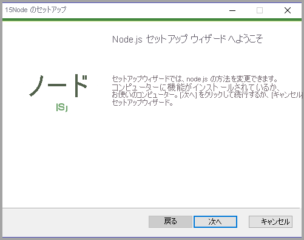

4. <span data-ttu-id="ed05c-128">コンピューターを再起動します。</span><span class="sxs-lookup"><span data-stu-id="ed05c-128">Restart the computer.</span></span>

### <a name="installing-packages"></a><span data-ttu-id="ed05c-129">パッケージのインストール</span><span class="sxs-lookup"><span data-stu-id="ed05c-129">Installing packages</span></span>

<span data-ttu-id="ed05c-130">次に、**pbiviz** パッケージをインストールする必要があります。</span><span class="sxs-lookup"><span data-stu-id="ed05c-130">Now you need to install the **pbiviz** package.</span></span>

1. <span data-ttu-id="ed05c-131">コンピューターが再起動された後に、Windows PowerShell を開きます。</span><span class="sxs-lookup"><span data-stu-id="ed05c-131">Open Windows PowerShell after the computer has been restarted.</span></span>

2. <span data-ttu-id="ed05c-132">pbiviz をインストールするには、次のコマンドを入力します。</span><span class="sxs-lookup"><span data-stu-id="ed05c-132">To install pbiviz, enter the following command.</span></span>

    ```powershell
    npm i -g powerbi-visuals-tools
    ```

### <a name="creating-and-installing-a-certificate"></a><span data-ttu-id="ed05c-133">証明書の作成とインストール</span><span class="sxs-lookup"><span data-stu-id="ed05c-133">Creating and installing a certificate</span></span>

#### <a name="windows"></a><span data-ttu-id="ed05c-134">Windows</span><span class="sxs-lookup"><span data-stu-id="ed05c-134">Windows</span></span>

1. <span data-ttu-id="ed05c-135">証明書を作成してインストールするには、次のコマンドを入力します。</span><span class="sxs-lookup"><span data-stu-id="ed05c-135">To create and install a certificate, enter the following command.</span></span>

    ```powershell
    pbiviz --install-cert
    ```

    <span data-ttu-id="ed05c-136">結果が返され、"*パスフレーズ*" が生成されています。</span><span class="sxs-lookup"><span data-stu-id="ed05c-136">It returns a result that produces a *passphrase*.</span></span> <span data-ttu-id="ed05c-137">ここでは、"*パスフレーズ*" は **_15105661266553327_** になっています。</span><span class="sxs-lookup"><span data-stu-id="ed05c-137">In this case, the *passphrase* is **_15105661266553327_**.</span></span> <span data-ttu-id="ed05c-138">証明書のインポート ウィザードも起動します。</span><span class="sxs-lookup"><span data-stu-id="ed05c-138">It also starts the Certificate Import Wizard.</span></span>

    

2. <span data-ttu-id="ed05c-140">証明書のインポート ウィザードで、ストアの場所が [現在のユーザー] に設定されていることを確認します。</span><span class="sxs-lookup"><span data-stu-id="ed05c-140">In the Certificate Import Wizard, verify that the store location is set to Current User.</span></span> <span data-ttu-id="ed05c-141">*[次へ]* を選択します。</span><span class="sxs-lookup"><span data-stu-id="ed05c-141">Then select *Next*.</span></span>

      

3. <span data-ttu-id="ed05c-143">**[File to Import]\(インポートするファイル\)** 手順で、 *[次へ]* を選択します。</span><span class="sxs-lookup"><span data-stu-id="ed05c-143">At the **File to Import** step, select *Next*.</span></span>

4. <span data-ttu-id="ed05c-144">**[秘密キーの保護]** 手順で、[パスワード] ボックスに、証明書の作成で受け取ったパスフレーズを貼り付けます。ここでも、パスフレーズは **_15105661266553327_** です。</span><span class="sxs-lookup"><span data-stu-id="ed05c-144">At the **Private Key Protection** step, in the Password box, paste the passphrase you received from creating the cert.  Again, in this case it is **_15105661266553327_**.</span></span>

      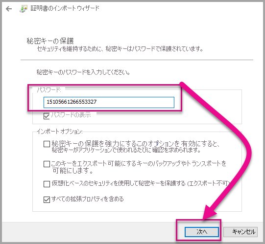

5. <span data-ttu-id="ed05c-146">**[証明書ストア]** 手順で、 **[証明書をすべて次のストアに配置する]** オプションを選択します。</span><span class="sxs-lookup"><span data-stu-id="ed05c-146">At the **Certificate Store** step, select the **Place all certificates in the Following store** option.</span></span> <span data-ttu-id="ed05c-147">次に、 *[参照]* を選択します。</span><span class="sxs-lookup"><span data-stu-id="ed05c-147">Then select *Browse*.</span></span>

      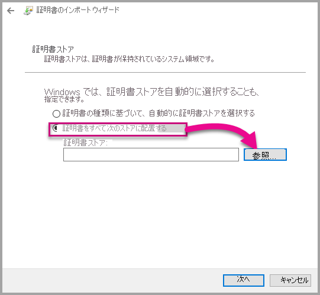

6. <span data-ttu-id="ed05c-149">**[証明書ストアの選択]** ウィンドウで、 **[信頼されたルート証明機関]** を選択して、 *[OK]* をクリックします。</span><span class="sxs-lookup"><span data-stu-id="ed05c-149">In the **Select Certificate Store** window, select **Trusted Root Certification Authorities** and then select *OK*.</span></span> <span data-ttu-id="ed05c-150">その後、 **[証明書ストア]** 画面で *[次へ]* をクリックします。</span><span class="sxs-lookup"><span data-stu-id="ed05c-150">Then select *Next* on the **Certificate Store** screen.</span></span>

      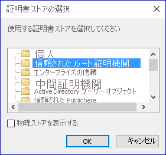

7. <span data-ttu-id="ed05c-152">インポートを完了するには、 **[完了]** を選択します。</span><span class="sxs-lookup"><span data-stu-id="ed05c-152">To complete the import, select **Finish**.</span></span>

8. <span data-ttu-id="ed05c-153">セキュリティの警告を受信した場合は、 **[はい]** を選択します。</span><span class="sxs-lookup"><span data-stu-id="ed05c-153">If you receive a security warning, select **Yes**.</span></span>

    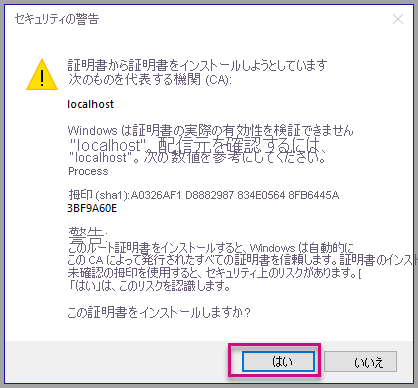

9. <span data-ttu-id="ed05c-155">インポートが成功したという通知を受け取った場合は、 **[OK]** をクリックします。</span><span class="sxs-lookup"><span data-stu-id="ed05c-155">When notified that the import was successful, select **OK**.</span></span>

    

> [!Important]
> <span data-ttu-id="ed05c-157">Windows PowerShell セッションを閉じないでください。</span><span class="sxs-lookup"><span data-stu-id="ed05c-157">Do not close the Windows PowerShell session.</span></span>

#### <a name="osx"></a><span data-ttu-id="ed05c-158">OSX</span><span class="sxs-lookup"><span data-stu-id="ed05c-158">OSX</span></span>

1. <span data-ttu-id="ed05c-159">左上の鍵がロックされている場合は、鍵を選択してロックを解除します。</span><span class="sxs-lookup"><span data-stu-id="ed05c-159">If the lock in the upper left is locked, select it to unlock.</span></span> <span data-ttu-id="ed05c-160">*localhost* を検索し、証明書をダブルクリックします。</span><span class="sxs-lookup"><span data-stu-id="ed05c-160">Search for *localhost* and double-click on the certificate.</span></span>

    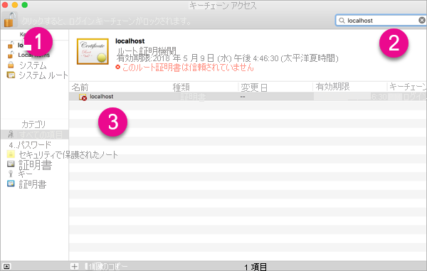

2. <span data-ttu-id="ed05c-162">**[Always Trust]** \(常に信頼する) を選択して、ウィンドウを閉じます。</span><span class="sxs-lookup"><span data-stu-id="ed05c-162">Select **Always Trust** and close the window.</span></span>

    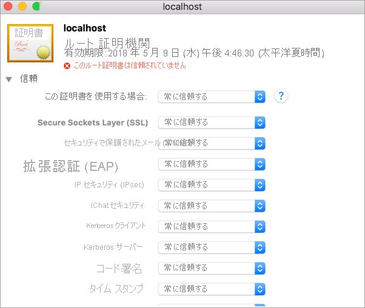

3. <span data-ttu-id="ed05c-164">ユーザー名とパスワードを入力します。</span><span class="sxs-lookup"><span data-stu-id="ed05c-164">Enter your username and password.</span></span> <span data-ttu-id="ed05c-165">**[Update Settings]** \(設定の更新) を選択します。</span><span class="sxs-lookup"><span data-stu-id="ed05c-165">Select **Update Settings**.</span></span>

    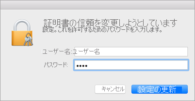

4. <span data-ttu-id="ed05c-167">開いているブラウザーをすべて閉じます。</span><span class="sxs-lookup"><span data-stu-id="ed05c-167">Close any browsers that you have open.</span></span>

> [!NOTE]
> <span data-ttu-id="ed05c-168">証明書が認識されない場合は、コンピューターの再起動が必要である可能性があります。</span><span class="sxs-lookup"><span data-stu-id="ed05c-168">If the certificate is not recognized, you may need to restart your computer.</span></span>

## <a name="creating-a-custom-visual"></a><span data-ttu-id="ed05c-169">カスタム ビジュアルの作成</span><span class="sxs-lookup"><span data-stu-id="ed05c-169">Creating a custom visual</span></span>

<span data-ttu-id="ed05c-170">環境を設定できたので、次はカスタム ビジュアルを作成します。</span><span class="sxs-lookup"><span data-stu-id="ed05c-170">Now that you have set up your environment, it is time to create your custom visual.</span></span>

<span data-ttu-id="ed05c-171">このチュートリアルの完全なソース コードを[ダウンロード](https://github.com/Microsoft/PowerBI-visuals-circlecard)できます。</span><span class="sxs-lookup"><span data-stu-id="ed05c-171">You can [download](https://github.com/Microsoft/PowerBI-visuals-circlecard) the full source code for this tutorial.</span></span>

1. <span data-ttu-id="ed05c-172">Power BI Visual Tools パッケージがインストール済みであることを確認します。</span><span class="sxs-lookup"><span data-stu-id="ed05c-172">Verify that the Power BI Visual Tools package has been installed.</span></span>

    ```powershell
    pbiviz
    ```
    <span data-ttu-id="ed05c-173">ヘルプの出力が表示されます。</span><span class="sxs-lookup"><span data-stu-id="ed05c-173">You should see the help output.</span></span>

    <pre><code>
        +syyso+/
    oms/+osyhdhyso/
    ym/       /+oshddhys+/
    ym/              /+oyhddhyo+/
    ym/                     /osyhdho
    ym/                           sm+
    ym/               yddy        om+
    ym/         shho /mmmm/       om+
        /    oys/ +mmmm /mmmm/       om+
    oso  ommmh +mmmm /mmmm/       om+
    ymmmy smmmh +mmmm /mmmm/       om+
    ymmmy smmmh +mmmm /mmmm/       om+
    ymmmy smmmh +mmmm /mmmm/       om+
    +dmd+ smmmh +mmmm /mmmm/       om+
            /hmdo +mmmm /mmmm/ /so+//ym/
                /dmmh /mmmm/ /osyhhy/
                    //   dmmd
                        ++

        PowerBI Custom Visual Tool

    Usage: pbiviz [options] [command]

    Commands:

    new [name]        Create a new visual
    info              Display info about the current visual
    start             Start the current visual
    package           Package the current visual into a pbiviz file
    update [version]  Updates the api definitions and schemas in the current visual. Changes the version if specified
    help [cmd]        display help for [cmd]

    Options:

    -h, --help      output usage information
    -V, --version   output the version number
    --install-cert  Install localhost certificate
    </code></pre>

    <a name="ssl-setup"></a>

2. <span data-ttu-id="ed05c-174">サポートされているコマンドの一覧を含む、出力を確認します。</span><span class="sxs-lookup"><span data-stu-id="ed05c-174">Review the output, including the list of supported commands.</span></span>

    

3. <span data-ttu-id="ed05c-176">カスタム ビジュアル プロジェクトを作成するために、次のコマンドを入力します。</span><span class="sxs-lookup"><span data-stu-id="ed05c-176">To create a custom visual project, enter the following command.</span></span> <span data-ttu-id="ed05c-177">**CircleCard** はプロジェクトの名前です。</span><span class="sxs-lookup"><span data-stu-id="ed05c-177">**CircleCard** is the name of the project.</span></span>

    ```PowerShell
    pbiviz new CircleCard
    ```
    

    > [!Note]
    > <span data-ttu-id="ed05c-179">プロンプトの現在の位置で、新しいプロジェクトを作成します。</span><span class="sxs-lookup"><span data-stu-id="ed05c-179">You create the new project at the current location of the prompt.</span></span>

4. <span data-ttu-id="ed05c-180">プロジェクト フォルダーに移動します。</span><span class="sxs-lookup"><span data-stu-id="ed05c-180">Navigate to the project folder.</span></span>

    ```powershell
    cd CircleCard
    ```
5. <span data-ttu-id="ed05c-181">カスタム ビジュアルを開始します。</span><span class="sxs-lookup"><span data-stu-id="ed05c-181">Start the custom visual.</span></span> <span data-ttu-id="ed05c-182">これで、お使いのコンピューターでホストしながら、CircleCard ビジュアルが実行中になりました。</span><span class="sxs-lookup"><span data-stu-id="ed05c-182">Your CircleCard visual is now running while being hosted on your computer.</span></span>

    ```powershell
    pbiviz start
    ```

    

> [!Important]
> <span data-ttu-id="ed05c-184">Windows PowerShell セッションを閉じないでください。</span><span class="sxs-lookup"><span data-stu-id="ed05c-184">Do not close the Windows PowerShell session.</span></span>

### <a name="testing-the-custom-visual"></a><span data-ttu-id="ed05c-185">カスタム ビジュアルのテスト</span><span class="sxs-lookup"><span data-stu-id="ed05c-185">Testing the custom visual</span></span>

<span data-ttu-id="ed05c-186">このセクションでは、Power BI Desktop レポートをアップロードし、カスタム ビジュアルを表示するようにレポートを編集して、CircleCard カスタム ビジュアルをテストします。</span><span class="sxs-lookup"><span data-stu-id="ed05c-186">In this section, we are going to test the CircleCard custom visual by uploading a Power BI Desktop report and then editing the report to display the custom visual.</span></span>

1. <span data-ttu-id="ed05c-187">[[PowerBI.com]](https://powerbi.microsoft.com/) にサインインして **[歯車] アイコン** に移動し、 **[設定]** を選択します。</span><span class="sxs-lookup"><span data-stu-id="ed05c-187">Sign in to [PowerBI.com](https://powerbi.microsoft.com/) > go to the **Gear icon** > then select **Settings**.</span></span>

      

2. <span data-ttu-id="ed05c-189">**[開発者]** を選択して、 **[テスト用の開発者向けビジュアルを有効にする]** チェックボックスをオンにします。</span><span class="sxs-lookup"><span data-stu-id="ed05c-189">Select **Developer** then check the **Enable Developer Visual for testing** checkbox.</span></span>

    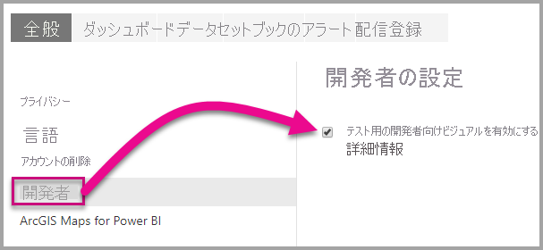

3. <span data-ttu-id="ed05c-191">Power BI Desktop レポートをアップロードします。</span><span class="sxs-lookup"><span data-stu-id="ed05c-191">Upload a Power BI Desktop report.</span></span>  

    <span data-ttu-id="ed05c-192">[データ] > [ファイル] > [ローカル ファイル] の順に移動します。</span><span class="sxs-lookup"><span data-stu-id="ed05c-192">Get Data > Files > Local File.</span></span>

    <span data-ttu-id="ed05c-193">まだ Power BI Desktop レポートをお持ちでない場合は、サンプルの Power BI Desktop レポートを[ダウンロード](https://microsoft.github.io/PowerBI-visuals/docs/step-by-step-lab/images/US_Sales_Analysis.pbix)できます。</span><span class="sxs-lookup"><span data-stu-id="ed05c-193">You can [download](https://microsoft.github.io/PowerBI-visuals/docs/step-by-step-lab/images/US_Sales_Analysis.pbix) a sample Power BI Desktop report if you do not have one created already.</span></span>

    <span data-ttu-id="ed05c-194"> </span><span class="sxs-lookup"><span data-stu-id="ed05c-194"> </span></span>

    <span data-ttu-id="ed05c-195">レポートを表示するには、左側のナビゲーション ウィンドウにある **[レポート]** セクションから **[US_Sales_Analysis]** を選択します。</span><span class="sxs-lookup"><span data-stu-id="ed05c-195">Now to view the report, select **US_Sales_Analysis** from the **Report** section in the navigation pane on the left.</span></span>

    

4. <span data-ttu-id="ed05c-197">次に、Power BI サービス内でレポートを編集する必要があります。</span><span class="sxs-lookup"><span data-stu-id="ed05c-197">Now you need to edit the report while in the Power BI service.</span></span>

    <span data-ttu-id="ed05c-198">**[レポートの編集]** へ移動します。</span><span class="sxs-lookup"><span data-stu-id="ed05c-198">Go to **Edit report**.</span></span>

    

5. <span data-ttu-id="ed05c-200">**[ビジュアル]** ウィンドウから **[開発者向けビジュアル]** を選択します。</span><span class="sxs-lookup"><span data-stu-id="ed05c-200">Select the **Developer Visual** from the **Visualizations** pane.</span></span>

    

    > [!Note]
    > <span data-ttu-id="ed05c-202">このビジュアルは、コンピューター上で起動したカスタム ビジュアルを表示しています。</span><span class="sxs-lookup"><span data-stu-id="ed05c-202">This visualization represents the custom visual that you started on your computer.</span></span> <span data-ttu-id="ed05c-203">開発者の設定が有効になっている場合のみ、利用可能です。</span><span class="sxs-lookup"><span data-stu-id="ed05c-203">It is only available when the developer settings have been enabled.</span></span>

6. <span data-ttu-id="ed05c-204">ビジュアルがレポート キャンバスに追加されたことを確認します。</span><span class="sxs-lookup"><span data-stu-id="ed05c-204">Notice that a visualization was added to the report canvas.</span></span>

    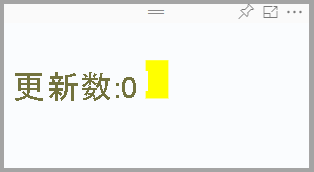

    > [!Note]
    > <span data-ttu-id="ed05c-206">これは、Update メソッドが呼び出された回数を表示する非常に簡単なビジュアルです。</span><span class="sxs-lookup"><span data-stu-id="ed05c-206">This is a very simple visual that displays the number of times its Update method has been called.</span></span> <span data-ttu-id="ed05c-207">この段階で、ビジュアルはまだデータを取得していません。</span><span class="sxs-lookup"><span data-stu-id="ed05c-207">At this stage, the visual does not yet retrieve any data.</span></span>

7. <span data-ttu-id="ed05c-208">レポートで新しいビジュアルを選択した状態で、[フィールド] ウィンドウに移動し、[売上] を展開して [数量] を選択します。</span><span class="sxs-lookup"><span data-stu-id="ed05c-208">While selecting the new visual in the report, Go to the Fields Pane > expand Sales > select Quantity.</span></span>

    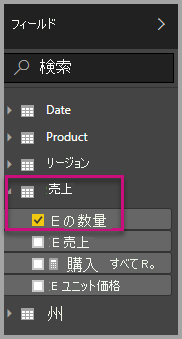

8. <span data-ttu-id="ed05c-210">次に、新しいビジュアルをテストするために、ビジュアルのサイズを変更して、更新値がインクリメントされていることを確認します。</span><span class="sxs-lookup"><span data-stu-id="ed05c-210">Then to test the new visual, resize the visual and notice the update value increments.</span></span>

    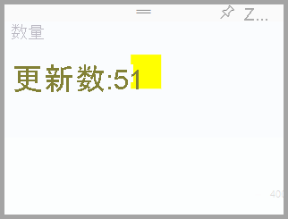

<span data-ttu-id="ed05c-212">PowerShell で実行されるカスタム ビジュアルを停止するために、Ctrl キーを押しながら C キーを押します。</span><span class="sxs-lookup"><span data-stu-id="ed05c-212">To stop the custom visual running in PowerShell, enter Ctrl+C.</span></span> <span data-ttu-id="ed05c-213">バッチ ジョブの終了を求められた場合は、Y を入力して、Enter キーを押します。</span><span class="sxs-lookup"><span data-stu-id="ed05c-213">When prompted to terminate the batch job, enter Y, then press Enter.</span></span>

## <a name="adding-visual-elements"></a><span data-ttu-id="ed05c-214">ビジュアル要素の追加</span><span class="sxs-lookup"><span data-stu-id="ed05c-214">Adding visual elements</span></span>

<span data-ttu-id="ed05c-215">次に、**D3 JavaScript ライブラリ** をインストールする必要があります。</span><span class="sxs-lookup"><span data-stu-id="ed05c-215">Now you need to install the **D3 JavaScript library**.</span></span> <span data-ttu-id="ed05c-216">D3 とは、Web ブラウザーに動的な対話型データのビジュアルを生成するための JavaScript ライブラリです。</span><span class="sxs-lookup"><span data-stu-id="ed05c-216">D3 is a JavaScript library for producing dynamic, interactive data visualizations in web browsers.</span></span> <span data-ttu-id="ed05c-217">広く実装されている SVG HTML5 および CSS 標準を利用します。</span><span class="sxs-lookup"><span data-stu-id="ed05c-217">It makes use of widely implemented SVG HTML5, and CSS standards.</span></span>

<span data-ttu-id="ed05c-218">これで、テキストと共に円を表示するカスタム ビジュアルを開発できるようになりました。</span><span class="sxs-lookup"><span data-stu-id="ed05c-218">Now you can develop the custom visual to display a circle with text.</span></span>

> [!Note]
> <span data-ttu-id="ed05c-219">このチュートリアルの多くのテキスト エントリは、[こちら](https://github.com/Microsoft/powerbi-visuals-circlecard)からコピーできます。</span><span class="sxs-lookup"><span data-stu-id="ed05c-219">Many text entries in this tutorial can be copied from [here](https://github.com/Microsoft/powerbi-visuals-circlecard).</span></span>

1. <span data-ttu-id="ed05c-220">PowerShell に **D3 ライブラリ**をインストールするために、次のコマンドを入力します。</span><span class="sxs-lookup"><span data-stu-id="ed05c-220">To install the **D3 library** in PowerShell, enter the command below.</span></span>

    ```powershell
    npm i d3@^5.0.0 --save
    ```

    ```powershell
    PS C:\circlecard>npm i d3@^5.0.0 --save
    + d3@5.11.0
    added 179 packages from 169 contributors and audited 306 packages in 33.25s
    found 0 vulnerabilities

    PS C:\circlecard>
    ```

2. <span data-ttu-id="ed05c-221">**D3 ライブラリ**の種類の定義をインストールするために、次のコマンドを入力します。</span><span class="sxs-lookup"><span data-stu-id="ed05c-221">To install type definitions for the **D3 library**, enter the command below.</span></span>

    ```powershell
    npm i @types/d3@^5.0.0 --save
    ```

    ```powershell
    PS C:\circlecard>npm i @types/d3@^5.0.0 --save
    + @types/d3@5.7.2
    updated 1 package and audited 306 packages in 2.217s
    found 0 vulnerabilities

    PS C:\circlecard>
    ```

    <span data-ttu-id="ed05c-222">このコマンドは、JavaScript ファイルに基づいて TypeScript 定義をインストールします。(JavaScript のスーパーセットである)TypeScript でのカスタム ビジュアルの開発が可能になります。</span><span class="sxs-lookup"><span data-stu-id="ed05c-222">This command installs TypeScript definitions based on JavaScript files, enabling you to develop the custom visual in TypeScript (which is a superset of JavaScript).</span></span> <span data-ttu-id="ed05c-223">Visual Studio Code は、TypeScript アプリケーションを開発するための理想的な IDE です。</span><span class="sxs-lookup"><span data-stu-id="ed05c-223">Visual Studio Code is an ideal IDE for developing TypeScript applications.</span></span>

3. <span data-ttu-id="ed05c-224">PowerShell で @no__t 0core-js @ no__t をインストールするには、次のコマンドを入力します。</span><span class="sxs-lookup"><span data-stu-id="ed05c-224">To install the **core-js** in PowerShell, enter the command below.</span></span>

    ```powershell
    npm i core-js@3.2.1 --save
    ```

    ```powershell
    PS C:\circlecard> npm i core-js@3.2.1 --save

    > core-js@3.2.1 postinstall F:\circlecard\node_modules\core-js
    > node scripts/postinstall || echo "ignore"

    Thank you for using core-js ( https://github.com/zloirock/core-js ) for polyfilling JavaScript standard library!

    The project needs your help! Please consider supporting of core-js on Open Collective or Patreon:
    > https://opencollective.com/core-js
    > https://www.patreon.com/zloirock

    + core-js@3.2.1
    updated 1 package and audited 306 packages in 6.051s
    found 0 vulnerabilities

    PS C:\circlecard>
    ```

    <span data-ttu-id="ed05c-225">このコマンドは、JavaScript 用のモジュール標準ライブラリをインストールします。</span><span class="sxs-lookup"><span data-stu-id="ed05c-225">This command installs modular standard library for JavaScript.</span></span> <span data-ttu-id="ed05c-226">これには、最大2019の ECMAScript の polyfills が含まれています。</span><span class="sxs-lookup"><span data-stu-id="ed05c-226">It includes polyfills for ECMAScript up to 2019.</span></span> <span data-ttu-id="ed05c-227">詳細については、 [`core-js`](https://www.npmjs.com/package/core-js)</span><span class="sxs-lookup"><span data-stu-id="ed05c-227">Read more about [`core-js`](https://www.npmjs.com/package/core-js)</span></span>

4. <span data-ttu-id="ed05c-228">PowerShell で @no__t 0powerbi-visual api @ no__t をインストールするには、次のコマンドを入力します。</span><span class="sxs-lookup"><span data-stu-id="ed05c-228">To install the **powerbi-visual-api** in PowerShell, enter the command below.</span></span>

    ```powershell
    npm i powerbi-visuals-api --save-dev
    ```

    ```powershell
    PS C:\circlecard>npm i powerbi-visuals-api --save-dev

    + powerbi-visuals-api@2.6.1
    updated 1 package and audited 306 packages in 2.139s
    found 0 vulnerabilities

    PS C:\circlecard>
    ```

    <span data-ttu-id="ed05c-229">このコマンドにより、Power BI のビジュアル API 定義がインストールされます。</span><span class="sxs-lookup"><span data-stu-id="ed05c-229">This command installs Power BI Visuals API definitions.</span></span>

5. <span data-ttu-id="ed05c-230">[Visual Studio Code](https://code.visualstudio.com/) を起動します。</span><span class="sxs-lookup"><span data-stu-id="ed05c-230">Launch [Visual Studio Code](https://code.visualstudio.com/).</span></span>

    <span data-ttu-id="ed05c-231">次のコマンドを使用して、PowerShell から **Visual Studio Code** を起動できます。</span><span class="sxs-lookup"><span data-stu-id="ed05c-231">You can launch **Visual Studio Code** from PowerShell by using the following command.</span></span>

    ```powershell
    code .
    ```

6. <span data-ttu-id="ed05c-232">**[エクスプローラー] ウィンドウ**で、 **[node_modules]** フォルダーを展開して **d3 ライブラリ**がインストールされたことを確認します。</span><span class="sxs-lookup"><span data-stu-id="ed05c-232">In the **Explorer pane**, expand the **node_modules** folder to verify that the **d3 library** was installed.</span></span>

    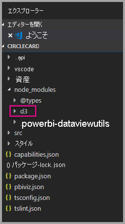

7. <span data-ttu-id="ed05c-234">No__t の \*\*Explorer ウィンドウで node_modules @types > d3 を展開して、ファイル \*\*index. no__t @ > が追加されていることを確認します。</span><span class="sxs-lookup"><span data-stu-id="ed05c-234">Make sure that file **index.d.ts** was added, by expanding node_modules > @types > d3 in the **Explorer pane**.</span></span>

    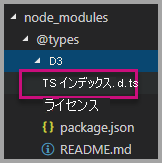

### <a name="developing-the-visual-elements"></a><span data-ttu-id="ed05c-236">ビジュアル要素の開発</span><span class="sxs-lookup"><span data-stu-id="ed05c-236">Developing the visual elements</span></span>

<span data-ttu-id="ed05c-237">ここでは、円とサンプル テキストを表示するカスタム ビジュアルを開発する方法を見ていきます。</span><span class="sxs-lookup"><span data-stu-id="ed05c-237">Now we can explore how to develop the custom visual to show a circle and sample text.</span></span>

1. <span data-ttu-id="ed05c-238">**[エクスプローラー] ウィンドウ**で、 **[src]** フォルダーを展開して、 **[visual.ts]** を選択します。</span><span class="sxs-lookup"><span data-stu-id="ed05c-238">In the **Explorer pane**, expand the **src** folder and then select **visual.ts**.</span></span>

    > [!Note]
    > <span data-ttu-id="ed05c-239">**visual.ts** ファイルの最上部のコメントに注目してください。</span><span class="sxs-lookup"><span data-stu-id="ed05c-239">Notice the comments at the top of the **visual.ts** file.</span></span> <span data-ttu-id="ed05c-240">MIT ライセンス契約の下で、Power BI カスタム ビジュアル パッケージを使用する権限が、無料で付与されます。</span><span class="sxs-lookup"><span data-stu-id="ed05c-240">Permission to use the Power BI custom visual packages is granted free of charge under the terms of the MIT License.</span></span> <span data-ttu-id="ed05c-241">契約の一環として、ファイルの最上部に必ずコメントを残す必要があります。</span><span class="sxs-lookup"><span data-stu-id="ed05c-241">As part of the agreement, you must leave the comments at the top of the file.</span></span>

2. <span data-ttu-id="ed05c-242">Visual クラスから、以下の既定のカスタム ビジュアル ロジックを削除します。</span><span class="sxs-lookup"><span data-stu-id="ed05c-242">Remove the following default custom visual logic from the Visual class.</span></span>
    * <span data-ttu-id="ed05c-243">4 つのクラス レベルのプライベート変数宣言。</span><span class="sxs-lookup"><span data-stu-id="ed05c-243">The four class-level private variable declarations.</span></span>
    * <span data-ttu-id="ed05c-244">コンストラクターのすべてのコード行。</span><span class="sxs-lookup"><span data-stu-id="ed05c-244">All lines of code from the constructor.</span></span>
    * <span data-ttu-id="ed05c-245">Update メソッドのすべてのコード行。</span><span class="sxs-lookup"><span data-stu-id="ed05c-245">All lines of code from the update method.</span></span>
    * <span data-ttu-id="ed05c-246">parseSettings および enumerateObjectInstances メソッドを含む、モジュール内の残りのすべての行。</span><span class="sxs-lookup"><span data-stu-id="ed05c-246">All remaining lines within the module, including the parseSettings and enumerateObjectInstances methods.</span></span>

    <span data-ttu-id="ed05c-247">モジュール コードが次のようになっていることを確認します。</span><span class="sxs-lookup"><span data-stu-id="ed05c-247">Verify that the module code looks like the following.</span></span>

    ```typescript
    "use strict";
    import "core-js/stable";
    import "../style/visual.less";
    import powerbi from "powerbi-visuals-api";
    import IVisual = powerbi.extensibility.IVisual;
    import VisualConstructorOptions = powerbi.extensibility.visual.VisualConstructorOptions;
    import VisualUpdateOptions = powerbi.extensibility.visual.VisualUpdateOptions;

    import * as d3 from "d3";
    type Selection<T extends d3.BaseType> = d3.Selection<T, any,any, any>;

    export class Visual implements IVisual {

        constructor(options: VisualConstructorOptions) {

        }

        public update(options: VisualUpdateOptions) {

        }
    }
    ```

3. <span data-ttu-id="ed05c-248">*Visual* クラス宣言の下に、次の class-level プロパティを挿入します。</span><span class="sxs-lookup"><span data-stu-id="ed05c-248">Beneath the *Visual* class declaration, insert the following class-level properties.</span></span>

    ```typescript
    export class Visual implements IVisual {
        // ...
        private host: IVisualHost;
        private svg: Selection<SVGElement>;
        private container: Selection<SVGElement>;
        private circle: Selection<SVGElement>;
        private textValue: Selection<SVGElement>;
        private textLabel: Selection<SVGElement>;
        // ...
    }
    ```

    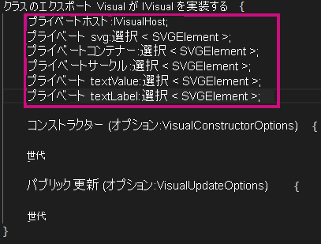

4. <span data-ttu-id="ed05c-250">次のコードを "*コンストラクター* "に追加します。</span><span class="sxs-lookup"><span data-stu-id="ed05c-250">Add the following code to the *constructor*.</span></span>

    ```typescript
    this.svg = d3.select(options.element)
        .append('svg')
        .classed('circleCard', true);
    this.container = this.svg.append("g")
        .classed('container', true);
    this.circle = this.container.append("circle")
        .classed('circle', true);
    this.textValue = this.container.append("text")
        .classed("textValue", true);
    this.textLabel = this.container.append("text")
        .classed("textLabel", true);
    ```

    <span data-ttu-id="ed05c-251">このコードでは、ビジュアルの中に SVG グループを追加して、そこに円と 2 つのテキスト要素という合計 3 つの図形を追加します。</span><span class="sxs-lookup"><span data-stu-id="ed05c-251">This code adds an SVG group inside the visual and then adds three shapes: a circle and two text elements.</span></span>

    <span data-ttu-id="ed05c-252">ドキュメント内のコードを書式設定するには、**Visual Studio Code ドキュメント**の任意の場所をクリックして、 **[ドキュメントのフォーマット]** を選択します。</span><span class="sxs-lookup"><span data-stu-id="ed05c-252">To format the code in the document, right-select anywhere in the **Visual Studio Code document**, and then select **Format Document**.</span></span>

      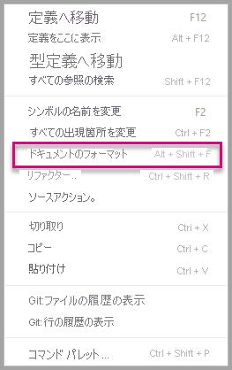

    <span data-ttu-id="ed05c-254">読みやすさを向上させるために、コード スニペットに貼り付ける際は、必ずドキュメントを書式設定することをお勧めします。</span><span class="sxs-lookup"><span data-stu-id="ed05c-254">To improve readability, it is recommended that you format the document every time that paste in code snippets.</span></span>

5. <span data-ttu-id="ed05c-255">*update* メソッドに次のコードを追加します。</span><span class="sxs-lookup"><span data-stu-id="ed05c-255">Add the following code to the *update* method.</span></span>

    ```typescript
    let width: number = options.viewport.width;
    let height: number = options.viewport.height;
    this.svg.attr("width", width);
    this.svg.attr("height", height);
    let radius: number = Math.min(width, height) / 2.2;
    this.circle
        .style("fill", "white")
        .style("fill-opacity", 0.5)
        .style("stroke", "black")
        .style("stroke-width", 2)
        .attr("r", radius)
        .attr("cx", width / 2)
        .attr("cy", height / 2);
    let fontSizeValue: number = Math.min(width, height) / 5;
    this.textValue
        .text("Value")
        .attr("x", "50%")
        .attr("y", "50%")
        .attr("dy", "0.35em")
        .attr("text-anchor", "middle")
        .style("font-size", fontSizeValue + "px");
    let fontSizeLabel: number = fontSizeValue / 4;
    this.textLabel
        .text("Label")
        .attr("x", "50%")
        .attr("y", height / 2)
        .attr("dy", fontSizeValue / 1.2)
        .attr("text-anchor", "middle")
        .style("font-size", fontSizeLabel + "px");
    ```

    <span data-ttu-id="ed05c-256">*このコードはビジュアルの幅と高さを設定して、ビジュアル要素の属性と形式を初期化します。*</span><span class="sxs-lookup"><span data-stu-id="ed05c-256">*This code sets the width and height of the visual, and then initializes the attributes and styles of the visual elements.*</span></span>

6. <span data-ttu-id="ed05c-257">**visual.ts** ファイルを保存します。</span><span class="sxs-lookup"><span data-stu-id="ed05c-257">Save the **visual.ts** file.</span></span>

7. <span data-ttu-id="ed05c-258">**capabilities.json** ファイルを選択します。</span><span class="sxs-lookup"><span data-stu-id="ed05c-258">Select the **capabilities.json** file.</span></span>

    <span data-ttu-id="ed05c-259">14 行目から、オブジェクト要素全体 (行 14 ～ 60) を削除します。</span><span class="sxs-lookup"><span data-stu-id="ed05c-259">At line 14, remove the entire objects element (lines 14-60).</span></span>

8. <span data-ttu-id="ed05c-260">**capabilities.json** ファイルを保存します。</span><span class="sxs-lookup"><span data-stu-id="ed05c-260">Save the **capabilities.json** file.</span></span>

9. <span data-ttu-id="ed05c-261">PowerShell で、カスタム ビジュアルを起動します。</span><span class="sxs-lookup"><span data-stu-id="ed05c-261">In PowerShell, start the custom visual.</span></span>

    ```powershell
    pbiviz start
    ```

### <a name="toggle-auto-reload"></a><span data-ttu-id="ed05c-262">自動再読み込みの切り替え</span><span class="sxs-lookup"><span data-stu-id="ed05c-262">Toggle auto reload</span></span>

1. <span data-ttu-id="ed05c-263">Power BI レポートに戻ります。</span><span class="sxs-lookup"><span data-stu-id="ed05c-263">Navigate back to the Power BI report.</span></span>
2. <span data-ttu-id="ed05c-264">開発者向けビジュアルの上に表示されるツールバーで、 **[自動再読み込みの切り替え]** を選択します。</span><span class="sxs-lookup"><span data-stu-id="ed05c-264">In the toolbar floating above the developer visual, select the **Toggle Auto Reload**.</span></span>

    

    <span data-ttu-id="ed05c-266">このオプションは、プロジェクトの変更を保存するたびに、ビジュアルが自動的に再読み込みされることを保証します。</span><span class="sxs-lookup"><span data-stu-id="ed05c-266">This option ensures that the visual is automatically reloaded each time you save project changes.</span></span>

3. <span data-ttu-id="ed05c-267">**[フィールド] ウィンドウ**から、 **[数量]** フィールドを開発者向けビジュアルにドラッグします。</span><span class="sxs-lookup"><span data-stu-id="ed05c-267">From the **Fields pane**, drag the **Quantity** field into the developer visual.</span></span>

4. <span data-ttu-id="ed05c-268">ビジュアルが次のようになっていることを確認します。</span><span class="sxs-lookup"><span data-stu-id="ed05c-268">Verify that the visual looks like the following.</span></span>

    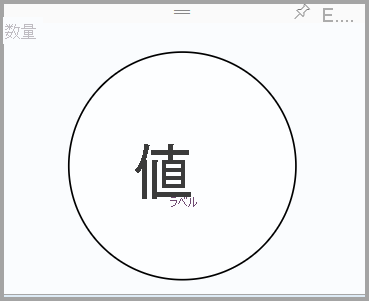

5. <span data-ttu-id="ed05c-270">ビジュアルのサイズを変更します。</span><span class="sxs-lookup"><span data-stu-id="ed05c-270">Resize the visual.</span></span>

    <span data-ttu-id="ed05c-271">ビジュアルで使用可能なディメンションに適合するように、円とテキストの値がスケーリングされることを確認します。</span><span class="sxs-lookup"><span data-stu-id="ed05c-271">Notice that the circle and text value scales to fit the available dimension of the visual.</span></span>

    <span data-ttu-id="ed05c-272">update メソッドは、ビジュアルのサイズ変更の際に連続で呼び出され、結果として、ビジュアル要素の再スケーリングが円滑に行われます。</span><span class="sxs-lookup"><span data-stu-id="ed05c-272">The update method is called continuously with resizing the visual, and it results in the fluid rescaling of the visual elements.</span></span>

    <span data-ttu-id="ed05c-273">これで、ビジュアル要素の開発が終わりました。</span><span class="sxs-lookup"><span data-stu-id="ed05c-273">You have now developed the visual elements.</span></span>

6. <span data-ttu-id="ed05c-274">引き続き、ビジュアルを実行します。</span><span class="sxs-lookup"><span data-stu-id="ed05c-274">Continue running the visual.</span></span>

## <a name="process-data-in-the-visual-code"></a><span data-ttu-id="ed05c-275">ビジュアルコードのデータを処理する</span><span class="sxs-lookup"><span data-stu-id="ed05c-275">Process data in the visual code</span></span>

<span data-ttu-id="ed05c-276">データ ロールとデータ ビューのマッピングを定義して、メジャーの値と表示名を表示するようにカスタム ビジュアル ロジックを変更します。</span><span class="sxs-lookup"><span data-stu-id="ed05c-276">Define the data roles and data view mappings, and then modify the custom visual logic to display the value and display name of a measure.</span></span>

### <a name="configuring-the-capabilities"></a><span data-ttu-id="ed05c-277">機能の構成</span><span class="sxs-lookup"><span data-stu-id="ed05c-277">Configuring the capabilities</span></span>

<span data-ttu-id="ed05c-278">**capabilities.json** ファイルを変更して、データ ロールとデータ ビューのマッピングを定義します。</span><span class="sxs-lookup"><span data-stu-id="ed05c-278">Modify the **capabilities.json** file to define the data role and data view mappings.</span></span>

1. <span data-ttu-id="ed05c-279">Visual Studio Code で、**capabilities.json** ファイルの **dataRoles** 配列内から、すべてのコンテンツ (行 3 ～ 12) を削除します。</span><span class="sxs-lookup"><span data-stu-id="ed05c-279">In Visual Studio code, in the **capabilities.json** file, from inside the **dataRoles** array, remove all content (lines 3-12).</span></span>

2. <span data-ttu-id="ed05c-280">**dataRoles** 配列内に、次のコードを挿入します。</span><span class="sxs-lookup"><span data-stu-id="ed05c-280">Inside the **dataRoles** array, insert the following code.</span></span>

    ```json
    {
        "displayName": "Measure",
        "name": "measure",
        "kind": "Measure"
    }
    ```

    <span data-ttu-id="ed05c-281">**dataRoles** 配列に、種類が**メジャー**の単一のデータ ロールを定義しました。名前は **measure**、表示は **Measure** となります。</span><span class="sxs-lookup"><span data-stu-id="ed05c-281">The **dataRoles** array now defines a single data role of type **measure**, that is named **measure**, and displays as **Measure**.</span></span> <span data-ttu-id="ed05c-282">このデータ ロールによって、メジャー フィールドまたは集計されたフィールドのどちらかを渡すことが可能になります。</span><span class="sxs-lookup"><span data-stu-id="ed05c-282">This data role allows passing either a measure field, or a field that is summarized.</span></span>

3. <span data-ttu-id="ed05c-283">**dataViewMappings** 配列内から、すべてのコンテンツ (行 10 ～ 31) を削除します。</span><span class="sxs-lookup"><span data-stu-id="ed05c-283">From inside the **dataViewMappings** array, remove all content (lines 10-31).</span></span>

4. <span data-ttu-id="ed05c-284">**dataViewMappings** 配列内に、次のコンテンツを挿入します。</span><span class="sxs-lookup"><span data-stu-id="ed05c-284">Inside the **dataViewMappings** array, insert the following content.</span></span>

    ```json
    {
        "conditions": [
            { "measure": { "max": 1 } }
        ],
        "single": {
            "role": "measure"
        }
    }
    ```

    <span data-ttu-id="ed05c-285">これで、**measure** という名前のデータ ロールに 1 つのフィールドを渡すことができるように、**dataViewMappings** 配列を定義しました。</span><span class="sxs-lookup"><span data-stu-id="ed05c-285">The **dataViewMappings** array now defines one field can be passed to the data role named **measure**.</span></span>

5. <span data-ttu-id="ed05c-286">**capabilities.json** ファイルを保存します。</span><span class="sxs-lookup"><span data-stu-id="ed05c-286">Save the **capabilities.json** file.</span></span>

6. <span data-ttu-id="ed05c-287">Power BI で、ビジュアルが**メジャー**と共に構成できるようになったことを確認します。</span><span class="sxs-lookup"><span data-stu-id="ed05c-287">In Power BI, notice that the visual now can be configured with **Measure**.</span></span>

    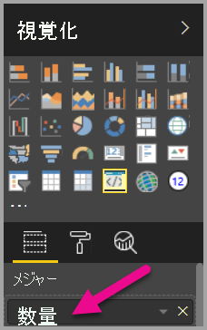

    > [!Note]
    > <span data-ttu-id="ed05c-289">ビジュアル プロジェクトには、データ バインド ロジックがまだ含まれていません。</span><span class="sxs-lookup"><span data-stu-id="ed05c-289">The visual project does not yet include data binding logic.</span></span>

### <a name="exploring-the-dataview"></a><span data-ttu-id="ed05c-290">データビューの確認</span><span class="sxs-lookup"><span data-stu-id="ed05c-290">Exploring the dataview</span></span>

1. <span data-ttu-id="ed05c-291">ビジュアルの上に表示されるツールバーで、 **[Dataview の表示]** を選択します。</span><span class="sxs-lookup"><span data-stu-id="ed05c-291">In the toolbar floating above the visual, select **Show Dataview**.</span></span>

    

2. <span data-ttu-id="ed05c-293">**single** まで下方向に展開して、値を確認します。</span><span class="sxs-lookup"><span data-stu-id="ed05c-293">Expand down into **single**, and then notice the value.</span></span>

    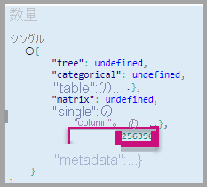

3. <span data-ttu-id="ed05c-295">**metadata** から、さらに **columns** 配列内へと下方向に展開して、特に **format** と **displayName** の値を確認します。</span><span class="sxs-lookup"><span data-stu-id="ed05c-295">Expand down into **metadata**, and then into the **columns** array, and in particular notice the **format** and **displayName** values.</span></span>

    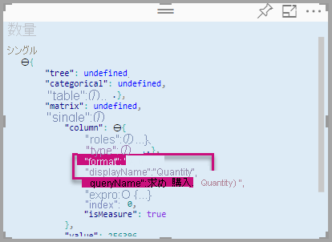

4. <span data-ttu-id="ed05c-297">もう一度ビジュアルに切り替えて、ビジュアルの上に表示されるツールバーで、 **[Dataview の表示]** を選択します。</span><span class="sxs-lookup"><span data-stu-id="ed05c-297">To toggle back to the visual, in the toolbar floating above the visual, select **Show Dataview**.</span></span>

    

### <a name="consume-data-in-the-visual-code"></a><span data-ttu-id="ed05c-299">ビジュアルコードのデータを使用する</span><span class="sxs-lookup"><span data-stu-id="ed05c-299">Consume data in the visual code</span></span>

1. <span data-ttu-id="ed05c-300">@No__t 0Visual Studio Code @ no__t-1 で、\*\*visual. ts @ no__t ファイルに</span><span class="sxs-lookup"><span data-stu-id="ed05c-300">In **Visual Studio Code**, in the **visual.ts** file,</span></span>

    <span data-ttu-id="ed05c-301">`powerbi` モジュールから `DataView` インターフェイスをインポートします</span><span class="sxs-lookup"><span data-stu-id="ed05c-301">import the `DataView` interface from `powerbi` module</span></span>

    ```typescript
    import DataView = powerbi.DataView;
    ```

    <span data-ttu-id="ed05c-302">次のステートメントを update メソッドの最初のステートメントとして追加します。</span><span class="sxs-lookup"><span data-stu-id="ed05c-302">and add the following statement as the first statement of the update method.</span></span>

    ```typescript
    let dataView: DataView = options.dataViews[0];
    ```

    

    <span data-ttu-id="ed05c-304">このステートメントでは、簡単にアクセスできるように *dataView* を 1 つの変数に代入して、*dataView* オブジェクトを参照するようにその変数を宣言します。</span><span class="sxs-lookup"><span data-stu-id="ed05c-304">This statement assigns the *dataView* to a variable for easy access, and declares the variable to reference the *dataView* object.</span></span>

2. <span data-ttu-id="ed05c-305">**update** メソッドで、 **.text("Value")** を次のように置き換えます。</span><span class="sxs-lookup"><span data-stu-id="ed05c-305">In the **update** method, replace **.text("Value")** with the following.</span></span>

    ```typescript
    .text(<string>dataView.single.value)
    ```

    

3. <span data-ttu-id="ed05c-307">**update** メソッドで、 **.text("Label")** を次のように置き換えます。</span><span class="sxs-lookup"><span data-stu-id="ed05c-307">In the **update** method, replace **.text("Label")** with the following.</span></span>

    ```typescript
    .text(dataView.metadata.columns[0].displayName)
    ```

    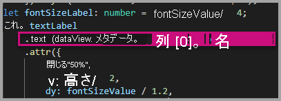

4. <span data-ttu-id="ed05c-309">**visual.ts** ファイルを保存します。</span><span class="sxs-lookup"><span data-stu-id="ed05c-309">Save the **visual.ts** file.</span></span>

5. <span data-ttu-id="ed05c-310">**Power BI** で、ビジュアルを確認します。値と表示名が表示されています。</span><span class="sxs-lookup"><span data-stu-id="ed05c-310">In **Power BI**, review the visual, which now displays the value and the display name.</span></span>

<span data-ttu-id="ed05c-311">これで、データ ロールを構成して、ビジュアルをデータビューにバインドできました。</span><span class="sxs-lookup"><span data-stu-id="ed05c-311">You have now configured the data roles and bound the visual to the dataview.</span></span>

<span data-ttu-id="ed05c-312">次のチュートリアルでは、カスタム ビジュアルに書式設定オプションを追加する方法について説明します。</span><span class="sxs-lookup"><span data-stu-id="ed05c-312">In the next tutorial you learn how to add formatting options to the custom visual.</span></span>

## <a name="debugging"></a><span data-ttu-id="ed05c-313">デバッグ</span><span class="sxs-lookup"><span data-stu-id="ed05c-313">Debugging</span></span>

<span data-ttu-id="ed05c-314">カスタム ビジュアルのデバッグに関するヒントについては、[デバッグ ガイド](https://microsoft.github.io/PowerBI-visuals/docs/how-to-guide/how-to-debug/)を参照してください。</span><span class="sxs-lookup"><span data-stu-id="ed05c-314">For tips about debugging your custom visual, see the [debugging guide](https://microsoft.github.io/PowerBI-visuals/docs/how-to-guide/how-to-debug/).</span></span>

## <a name="next-steps"></a><span data-ttu-id="ed05c-315">次の手順</span><span class="sxs-lookup"><span data-stu-id="ed05c-315">Next steps</span></span>

> [!div class="nextstepaction"]
> [<span data-ttu-id="ed05c-316">書式設定オプションの追加</span><span class="sxs-lookup"><span data-stu-id="ed05c-316">Adding formatting options</span></span>](custom-visual-develop-tutorial-format-options.md)
